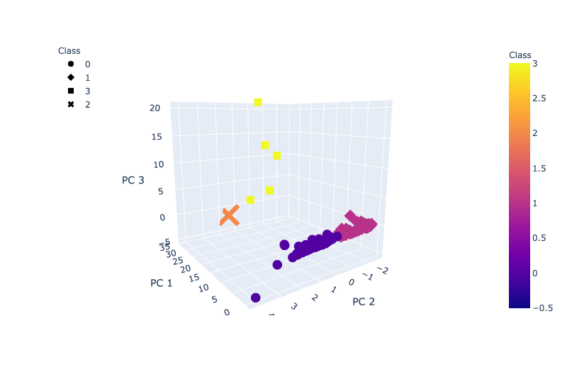

# cryptos
*Columbia Data Analytics Boot Camp* - Module 18 - Unsupervised Machine Learning and Cryptocurrencies - Used unsupervised machine learning techniques to analyze cryptocurrency data.

## What I Learned/Achieved:
- How to describe the differences between supervised and unsupervised learning, including real-world examples of each.
- How to preprocess data for unsupervised learning.
- How to cluster data using the K-means algorithm.
- How to determine the best amount of centroids for K-means using the elbow curve.
- How to use PCA to limit features and speed up the model.

## Purpose:
Cryptocurrencies are a new phenomenon built on code. Their value has recently increased rapidly and they have caught the 
attention of economists, traders, lawyers, etc. The cryptocurrencies can be traded, constructed, and mined. The purpose 
of this repo is to visualize the data of different cryptocurrencies using K-means to plot the data on a 3-D diagram. 
The second task is to create a table about the data that stores the data for immediate and flexible use in other analyses. 
Lastly, the data should be presented in a 2-D format to show a different insight into the data and highlight
possible relationships. 

## Results:
The results are a visualization of the different cryptocurrencies and their supply levels. This is valuable economic information because the supply with the demand affect the price of the currency being traded. The visualization is pretty, the data from the table is useful, and the 2-D shows some correlation in total coins in supply and total coins mined.

_3D Graph_ :

_Crypto Table_ :

_Bokeh Plot of Cryptos_ :

